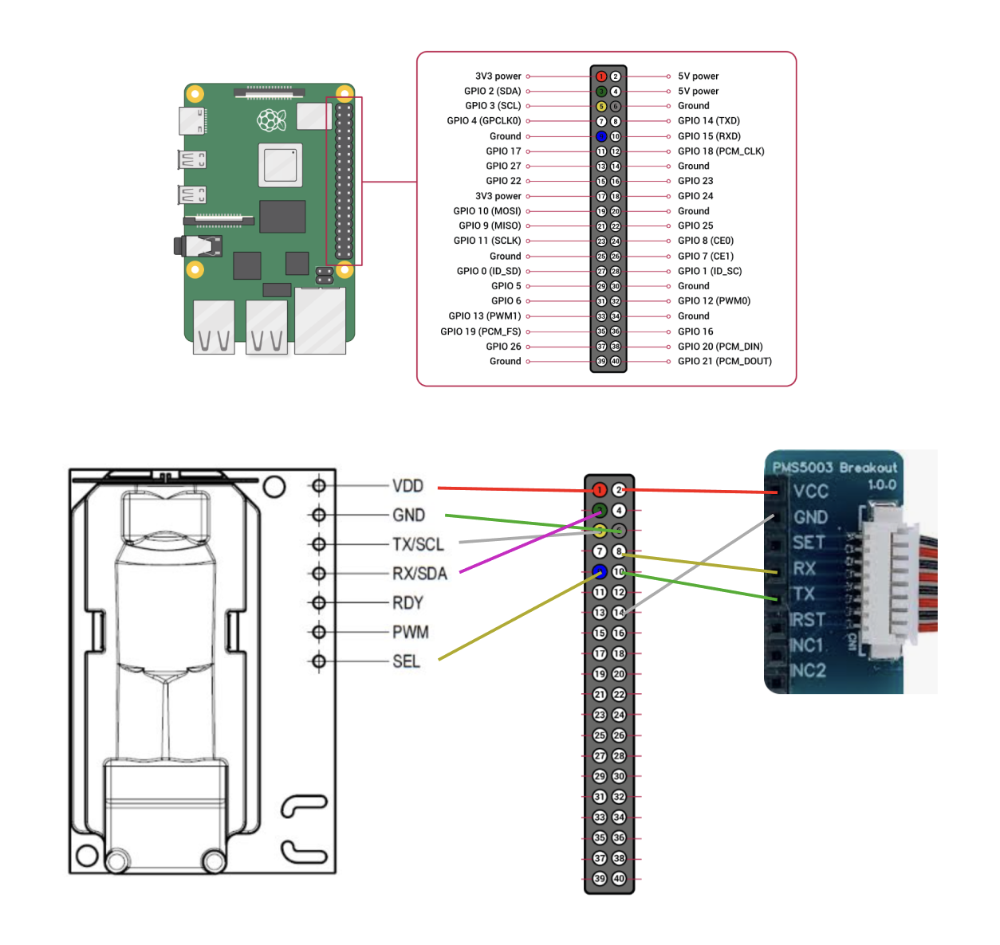

# Monipi

Monipi is a Raspberry Pi-based environmental monitoring project for learning how to read, log, and later display indoor air quality data.

It currently uses two sensors:

- **SCD30** - CO₂ in ppm, temperature in °C, and relative humidity in %
- **PMS5003** - particulate matter readings for PM1.0, PM2.5, PM10, plus particle counts

The project is intentionally simple. The aim is to understand the full pipeline: hardware wiring, sensor reads, data logging, averaging, background running, and eventually a basic web status page.

---

## What Monipi does

Monipi runs as a continuous sampling loop.

At each sampling interval:

- reads the SCD30 sensor
- reads the PMS5003 sensor
- writes raw readings to CSV
- stores values in memory for the current reporting window

At the end of each reporting window:

- calculates averaged values
- writes averaged readings to CSV
- keeps the process running for the next window

Each raw row includes:

- local timestamp, for human readability
- UTC timestamp, for consistency and later processing

---

## Project structure

Current package structure:

```text
monipi/
├── data/
├── setup/
├── src/
│   └── monipi/
│       ├── __main__.py
│       ├── config.py
│       ├── mgr_data.py
│       ├── mgr_exits.py
│       ├── mgr_sensor_state.py
│       ├── mgr_session.py
│       ├── mgr_time.py
│       ├── sample_pms5003.py
│       ├── sample_scd30.py
│       └── sampler.py
├── tests/
├── pyproject.toml
└── readme.md
```

Main responsibilities:

- `__main__.py` starts the application
- `sampler.py` controls the sampling loop and reporting window
- `sample_scd30.py` reads one SCD30 sample
- `sample_pms5003.py` reads one PMS5003 sample
- `mgr_sensor_state.py` keeps sensor objects alive and avoids repeated hardware initialisation
- `mgr_data.py` owns CSV schemas and file writing
- `mgr_session.py` manages session-level state
- `mgr_time.py` handles time formatting and reporting intervals
- `mgr_exits.py` handles controlled shutdown behaviour
- `config.py` defines mode, timing, and runtime configuration

Sensors are initialised once and kept running. They are not reset between samples when running on mains power.

---

## Data storage

Raw readings are stored separately per sensor:

- `data/current_samples_scd30.csv`
- `data/current_samples_pms5003.csv`

Averaged readings are also stored in CSV files.

CSV is used because it is transparent, easy to inspect, and easy to reuse later in a web page, dashboard, spreadsheet, or database.

---

## Development setup

Create and activate a virtual environment:

```bash
python3 -m venv .venv
source .venv/bin/activate
```

Install the project in editable mode:

```bash
pip install -e .
```

Install any required runtime libraries listed in `pyproject.toml`.

Useful sensor libraries:

```bash
pip install sensirion-i2c-scd30 pms5003
```

If Flask is added for the web interface:

```bash
pip install flask
```

Run Monipi locally:

```bash
python -m monipi
```

In development mode, mock sensor data is used so the code can run without the sensors attached.

---

## Raspberry Pi setup

On the Raspberry Pi, open config:

```bash
sudo raspi-config
```

Enable:

- I²C, for the SCD30
- Serial, for the PMS5003

The PMS5003 uses serial via `/dev/serial0`.

The SCD30 uses I²C.

---

## Wiring

Use the wiring diagram in `setup/wiring_diagram.png` as the main wiring reference.



### SCD30 wiring

| SCD30 pin | Raspberry Pi pin | Purpose |
|---|---:|---|
| VDD | Pin 1 | 3.3V power |
| GND | Pin 6 | Ground |
| TX/SCL | Pin 5 | I²C SCL / GPIO 3 |
| RX/SDA | Pin 3 | I²C SDA / GPIO 2 |
| SEL | Pin 9 | Ground, selects I²C mode |

Do not connect:

- RDY
- PWM

### PMS5003 wiring

| PMS5003 pin | Raspberry Pi pin | Purpose |
|---|---:|---|
| VCC | Pin 2 | 5V power |
| GND | Pin 14 | Ground |
| RX | Pin 8 | Pi TXD / GPIO 14 |
| TX | Pin 10 | Pi RXD / GPIO 15 |

The PMS5003 breakout also has other pins, but these are not required for the current setup.

---

## Running as a service

A systemd service file is included in `setup/monipi.service`.

Copy it to systemd:

```bash
sudo cp setup/monipi.service /etc/systemd/system/monipi.service
```

Reload systemd:

```bash
sudo systemctl daemon-reload
```

Enable Monipi to start on boot:

```bash
sudo systemctl enable monipi
```

Start it:

```bash
sudo systemctl start monipi
```

Check status:

```bash
systemctl status monipi
```

Follow logs:

```bash
journalctl -u monipi.service -f
```

If the project folder is renamed, update `WorkingDirectory` and `ExecStart` inside `setup/monipi.service` and `/etc/systemd/system/monipi.service`.

### Running the web dashboard as a service

A separate systemd service is used for the Flask web interface.

Copy the web service file:

```bash
sudo cp setup/monipi-web.service /etc/systemd/system/monipi-web.service
```

Reload systemd:

```bash
sudo systemctl daemon-reload
```

Enable the web dashboard to start on boot:

```bash
sudo systemctl enable monipi-web
```

Start it:

```bash
sudo systemctl start monipi-web
```

Check status:

```bash
systemctl status monipi-web
```

Follow logs:

```bash
journalctl -u monipi-web.service -f
```

The web service runs independently from the main Monipi sampler. If the sampler is not running, the dashboard should still load but display no or stale data.

---

## Power considerations

The current version is designed for mains power.

Sensors remain powered and in continuous measurement mode. There is no power-cycling between readings.

Possible future battery optimisations:

- sleep the PMS5003 between reads
- reduce Wi-Fi usage
- increase the reporting interval
- add a low-power operating mode

---

## Planned web interface

A simple web interface should show:

- whether Monipi is running
- latest SCD30 reading
- latest PMS5003 reading
- latest sample timestamp
- current session details

The first version should be a basic status page, not a full dashboard.

---

## Useful links

- SCD30 Python docs: <https://sensirion.github.io/python-i2c-scd30/index.html>
- Pimoroni PMS5003 Python library: <https://github.com/pimoroni/pms5003-python>